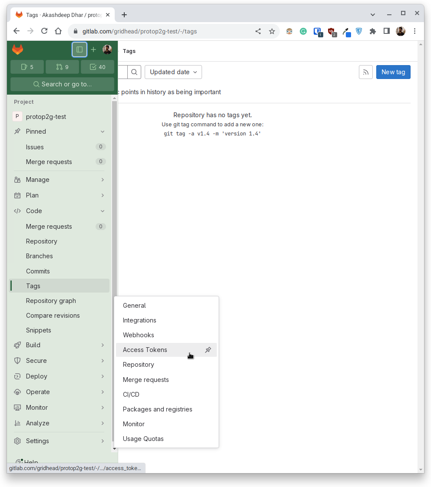

# protop2g
A prototype project assets importer that moves repositories from Pagure to GitLab

## Usage

### Installation

1. Ensure that you have `git`, `python3`, `virtualenv` and `poetry` installed.
    ```
    $ sudo dnf install git python3 virtualenv poetry --setopt=install_weak_deps=False
    ```
2. Clone the repository to the local storage and make it the present working directory.
    ```
    $ git clone https://github.com/gridhead/protop2g.git
    ```
    ```
    $ cd protop2g
    ```
    Sample output  
    ```
    Cloning into 'protop2g'...
    remote: Enumerating objects: 118, done.
    remote: Counting objects: 100% (118/118), done.
    remote: Compressing objects: 100% (78/78), done.
    remote: Total 118 (delta 48), reused 94 (delta 31), pack-reused 0
    Receiving objects: 100% (118/118), 56.38 KiB | 4.34 MiB/s, done.
    Resolving deltas: 100% (48/48), done.
    ```
3. Create and activate a Python virtual environment in that directory.
    ```
    $ virtualenv venv
    ```
    ```
    (venv) $ source venv/bin/activate
    ```
    Sample output  
    ```
    created virtual environment CPython3.11.5.final.0-64 in 143ms
      creator CPython3Posix(dest=/home/archdesk/Projects/protop2g/venv, clear=False, no_vcs_ignore=False, global=False)
      seeder FromAppData(download=False, pip=bundle, setuptools=bundle, wheel=bundle, via=copy, app_data_dir=/home/archdesk/.local/share/virtualenv)
        added seed packages: pip==23.2.1, setuptools==68.0.0, wheel==0.41.1
      activators BashActivator,CShellActivator,FishActivator,NushellActivator,PowerShellActivator,PythonActivator
    ```
4. Check the project configuration's validity and then install the project dependencies.
    ```
    (venv) $ poetry check
    ```
    ```
    (venv) $ poetry install
    ```
    Sample output  
    ```
    All set!
    ```
    ```
    Installing dependencies from lock file
    
    Package operations: 19 installs, 0 updates, 0 removals
    
      • Installing smmap (5.0.0)
      • Installing certifi (2022.12.7)
      • Installing charset-normalizer (3.0.1)
      • Installing click (8.1.3)
      • Installing gitdb (4.0.10)
      • Installing idna (3.4)
      • Installing mccabe (0.6.1)
      • Installing mypy-extensions (0.4.3)
      • Installing pathspec (0.11.0)
      • Installing platformdirs (2.6.2)
      • Installing pycodestyle (2.8.0)
      • Installing pyflakes (2.4.0)
      • Installing urllib3 (1.26.14)
      • Installing black (22.12.0)
      • Installing flake8 (4.0.1)
      • Installing gitpython (3.1.30)
      • Installing isort (5.12.0)
      • Installing requests (2.28.2)
      • Installing tqdm (4.64.1)
    
    Installing the current project: protop2g (0.1.0)
    ```

## Setup

1. Using a browser of your choice, open up [Pagure](https://pagure.io) and login to your account.
    
2. Click on your profile display picture and then, head over to the [Account Settings](https://pagure.io/settings) page.
    
3. Under the [API Keys](https://pagure.io/settings#nav-api-tab) section, click on the [Create new API key](https://pagure.io/settings/token/new) button in the top right corner.
    
4. As this is the source namespace, check all the ACLs that are required to read the asset information associated with a repository, set a safe expiration date for the API token and write an appropriate description for its usage before clicking on the [Create](#) button.
    
5. Make note of the API token generated and ensure that they are not shared with others or used for a different purpose.
    
6. Head over to a repository that the currently logged-in username has at least a READ access to.
    
7. Make note of the source namespace in the format of `HOLDER/REPONAME` where the `HOLDER` can be a group or a sole user.  
    For example, in case of a repository located at `https://pagure.io/fedora-infra/ansible` - the source namespace would be `fedora-infra/ansible`.
    
8. In another browser tab or window, open up [GitLab](https://gitlab.com/) and login to your account.
    
9. Click on the [New project/repository](https://gitlab.com/projects/new) option from the sidebar of the profile page and then, click on the [Create blank project](https://gitlab.com/projects/new#blank_project) option.
    
10. Create a new empty repository which will act as the destination for the asset transfer. It is recommended to have the same name as the source namespace to avoid confusion, but it is not strictly required.
    
11. Head over to the created repository and make note of the `Project ID`.  
    For example in this case, it is `42823949` for the destination repository named `gridhead/protop2g-test`.  
    
12. Expand the sidebar to head over to the [Access Tokens](https://gitlab.com/gridhead/protop2g-test/-/settings/access_tokens) section from the `Settings` section.
    
13. In the [Project Access Token](https://gitlab.com/gridhead/protop2g-test/-/settings/access_tokens) page, click on the [Add new token](#) button to begin creating a new access token.
    
14. As this is the destination namespace, check all the scopes that are required to write the asset information associated with a repository, pick an appropriate role, set a safe expiration date and write an appropriate description for its usage before clicking on the [Create project access token](#) button.
    
15. Make note of the API token generated and ensure that they are not shared with others or used for a different purpose.
    
16. Ensure that you have the following information handy before proceeding to the next steps.
    1. Username of an account that has at least the READ permissions in the source namespace on Pagure
    2. Access token belonging to the aforementioned account with appropriate ACLs checked required for at least the READ permissions in the source namespace
    3. Name of the source namespace in the format `HOLDER/REPONAME` where the `HOLDER` can be a group or a sole user
    4. Username of an account that has at least the WRITE permissions in the destination namespace on GitLab
    5. Access token belonging to that aforementioned account appropriate roles and scopes required for at least the WRITE permissions in the destination namespace
    6. Name of the destination namespace in the format of uniquely identifiable `PROJECTID` string

