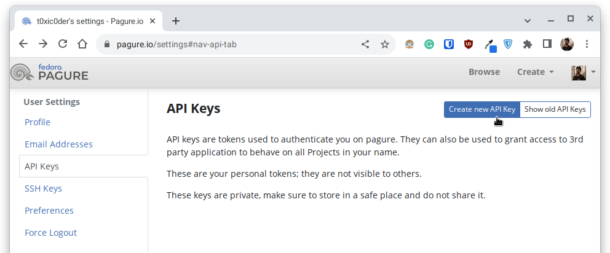
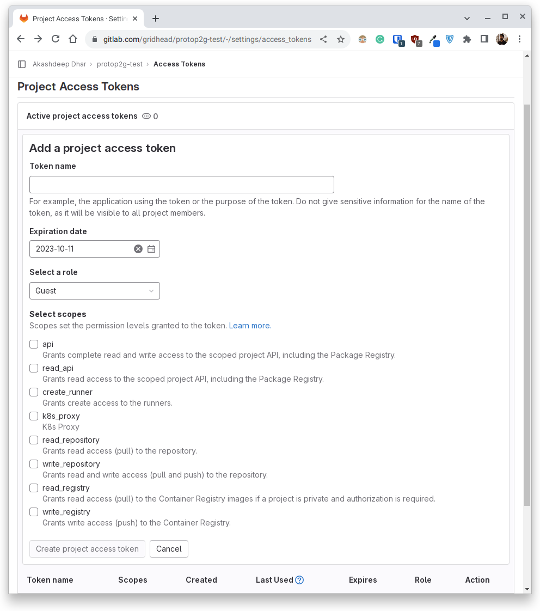

# Pagure Exporter
A prototype project assets importer that moves repositories from Pagure to GitLab

## Usage

### Installation

1. Ensure that you have `git`, `python3`, `virtualenv` and `poetry` installed.

    ```
    $ sudo dnf install git python3 virtualenv poetry --setopt=install_weak_deps=False
    ```

2. Clone the repository to the local storage and make it the present working directory.

    ```
    $ git clone https://github.com/gridhead/pagure-exporter.git
    ```

    ```
    $ cd pagure-exporter
    ```

    Sample output

    ```
    Cloning into 'pagure-exporter'...
    remote: Enumerating objects: 118, done.
    remote: Counting objects: 100% (118/118), done.
    remote: Compressing objects: 100% (78/78), done.
    remote: Total 118 (delta 48), reused 94 (delta 31), pack-reused 0
    Receiving objects: 100% (118/118), 56.38 KiB | 4.34 MiB/s, done.
    Resolving deltas: 100% (48/48), done.
    ```

3. Create and activate a Python virtual environment in that directory.

    ```
    $ virtualenv venv
    ```

    ```
    (venv) $ source venv/bin/activate
    ```

    Sample output

    ```
    created virtual environment CPython3.11.5.final.0-64 in 143ms
      creator CPython3Posix(dest=/home/archdesk/Projects/pagure-exporter/venv, clear=False, no_vcs_ignore=False, global=False)
      seeder FromAppData(download=False, pip=bundle, setuptools=bundle, wheel=bundle, via=copy, app_data_dir=/home/archdesk/.local/share/virtualenv)
        added seed packages: pip==23.2.1, setuptools==68.0.0, wheel==0.41.1
      activators BashActivator,CShellActivator,FishActivator,NushellActivator,PowerShellActivator,PythonActivator
    ```

4. Check the project configuration's validity and then install the project dependencies.

    ```
    (venv) $ poetry check
    ```

    ```
    (venv) $ poetry install
    ```

    Sample output

    ```
    All set!
    ```

    ```
    Installing dependencies from lock file

    Package operations: 19 installs, 0 updates, 0 removals

      • Installing smmap (5.0.0)
      • Installing certifi (2022.12.7)
      • Installing charset-normalizer (3.0.1)
      • Installing click (8.1.3)
      • Installing gitdb (4.0.10)
      • Installing idna (3.4)
      • Installing mccabe (0.6.1)
      • Installing mypy-extensions (0.4.3)
      • Installing pathspec (0.11.0)
      • Installing platformdirs (2.6.2)
      • Installing pycodestyle (2.8.0)
      • Installing pyflakes (2.4.0)
      • Installing urllib3 (1.26.14)
      • Installing black (22.12.0)
      • Installing flake8 (4.0.1)
      • Installing gitpython (3.1.30)
      • Installing isort (5.12.0)
      • Installing requests (2.28.2)
      • Installing tqdm (4.64.1)

    Installing the current project: pagure-exporter (0.1.0)
    ```

5. Check the current version of the installed project as well as the usage information.

    ```
    (venv) $ pagure-exporter --version
    ```

    ```
    (venv) $ pagure-exporter --help
    ```

    Sample output

    ```
    Pagure Exporter by Akashdeep Dhar <t0xic0der@fedoraproject.org>, version 0.1.0
    ```

    ```
    Usage: pagure-exporter [OPTIONS] COMMAND [ARGS]...

    Options:
      -s, --srce TEXT  Source namespace for importing assets from  [required]
      -d, --dest TEXT  Destination namespace for exporting assets to  [required]
      -p, --pkey TEXT  Pagure API key for accessing the source namespace
                       [required]
      -g, --gkey TEXT  GitLab API key for accessing the destination namespace
                       [required]
      -f, --fusr TEXT  Username of the account that owns the Pagure API key
                       [required]
      -t, --tusr TEXT  Username of the account that owns the GitLab API key
                       [required]
      --version        Show the version and exit.
      --help           Show this message and exit.

    Commands:
      repo  Initialize transfer of repository assets
      tkts  Initiate transfer of issue tickets
    ```

6. Check the usage information of the available subcommands.

    ```
    (venv) $ pagure-exporter -s a -d a -p a -g a -f a -t a repo --help
    ```

    ```
    (venv) $ pagure-exporter -s a -d a -p a -g a -f a -t a tkts --help
    ```

    Sample output

    ```
    Usage: pagure-exporter repo [OPTIONS]

      Initialize transfer of repository assets

    Options:
      -b, --brcs TEXT  List of branches to extract
      --help           Show this message and exit.
    ```

    ```
    Usage: pagure-exporter tkts [OPTIONS]

      Initiate transfer of issue tickets

    Options:
      -o, --open  Extract only the open issue tickets
      -c, --shut  Extract only the closed issue tickets
      -a, --full  Extract all the issue tickets
      --help      Show this message and exit.
    ```

## Setup

1. Using an internet browser of your choice, open up [Pagure](https://pagure.io) and login to your account.

    

2. Click on your profile display picture and then, head over to the [Account Settings](https://pagure.io/settings) page.

    

3. Under the [API Keys](https://pagure.io/settings#nav-api-tab) section, click on the [Create new API key](https://pagure.io/settings/token/new) button in the top right corner.

    

4. As this is the source namespace, check all the ACLs that are required to read the asset information associated with a repository, set a safe expiration date for the API token and write an appropriate description for its usage before clicking on the [Create](#) button.

    

5. Make note of the API token generated and ensure that they are not shared with others or used for a different purpose.

    

6. Head over to a repository that the currently logged-in username has at least a READ access to.

    

7. Make note of the source namespace in the format of `HOLDER/REPONAME` where the `HOLDER` can be a group or a sole user.
   For example, in case of a repository located at `https://pagure.io/fedora-infra/ansible` - the source namespace would be `fedora-infra/ansible`.

    

8. In another internet browser tab or window, open up [GitLab](https://gitlab.com/) and login to your account.

    

9. Click on the [New project/repository](https://gitlab.com/projects/new) option from the sidebar of the profile page and then, click on the [Create blank project](https://gitlab.com/projects/new#blank_project) option.

    

10. Create a new empty repository which will act as the destination for the asset transfer. It is recommended to have the same name as the source namespace to avoid confusion, but it is not strictly required.

    

11. Head over to the created repository and make note of the `Project ID`.
    For example in this case, it is `42823949` for the destination repository named `gridhead/pagure-exporter-test`.

    

12. Expand the sidebar to head over to the [Access Tokens](https://gitlab.com/gridhead/pagure-exporter-test/-/settings/access_tokens) section from the `Settings` section.

    

13. In the [Project Access Token](https://gitlab.com/gridhead/pagure-exporter-test/-/settings/access_tokens) page, click on the [Add new token](#) button to begin creating a new access token.

    

14. As this is the destination namespace, check all the scopes that are required to write the asset information associated with a repository, pick an appropriate role, set a safe expiration date and write an appropriate description for its usage before clicking on the [Create project access token](#) button.

    

15. Make note of the API token generated and ensure that they are not shared with others or used for a different purpose.

    

16. Ensure that you have the following information handy before proceeding to the next steps.

    1. Username of an account that has at least the READ permissions in the source namespace on Pagure (Say `srceuser`)
    2. Access token belonging to the aforementioned account with appropriate ACLs checked required for at least the READ permissions in the source namespace (Say `srcecode`)
    3. Name of the source namespace in the format `HOLDER/REPONAME` where the `HOLDER` can be a group or a sole user (Say `srcerepo`)
    4. Username of an account that has at least the WRITE permissions in the destination namespace on GitLab (Say `destuser`)
    5. Access token belonging to that aforementioned account appropriate roles and scopes required for at least the WRITE permissions in the destination namespace (Say `destcode`)
    6. Name of the destination namespace in the format of uniquely identifiable `PROJECTID` string (Say `destrepo`)

## Migrate repository assets

1. Ensure that the location where the project repository was cloned is the present working directory and that the previously populated virtual environment is enabled.

    ```
    $ cd pagure-exporter
    ```

    ```
    $ source venv/bin/activate
    ```

2. Using an internet browser of your choice, visit the source namespace repository page on Pagure to pick the branches that you wish to transfer.

    

3. Execute the following command to begin migrating the repository assets from the source namespace on Pagure to the destination namespace on GitLab.

    1. If only a set of branches are to be migrated

        ```
        (venv) $ pagure-exporter \
                 --fusr srceuser --pkey srcecode --srce srcerepo \
                 --tusr destuser --gkey destcode --dest destrepo \
                 repo \
                 --brcs brca,brcb,brcc,brcd
        ```

        For a set of branches available in the source namespace named `brca`, `brcb`, `brcc` and `brcd` to be migrated to the destination namespace.

    2. If all the available branches are to be migrated

        ```
        (venv) $ pagure-exporter \
                 --fusr srceuser --pkey srcecode --srce srcerepo \
                 --tusr destuser --gkey destcode --dest destrepo \
                 repo
        ```

       This is the default behaviour of the subcommand so if no branch names are provided, all the branches from the source namespace are migrated

## Migrate issue tickets

1. Ensure that the location where the project repository was cloned is the present working directory and that the previously populated virtual environment is enabled.

    ```
    $ cd pagure-exporter
    ```

    ```
    $ source venv/bin/activate
    ```

2. Execute the following command to begin extracting the issue tickets from the source namespace on Pagure to the destination namespace.

   1. If the issue tickets of a certain status need to be transferred.

      ```
      (venv) $ pagure-exporter \
                 --fusr srceuser --pkey srcecode --srce srcerepo \
                 --tusr destuser --gkey destcode --dest destrepo \
                 tkts \
                 --status open
      ```

   2. If the comments associated with the issue tickets need to be transferred.

      ```
      (venv) $ pagure-exporter \
                 --fusr srceuser --pkey srcecode --srce srcerepo \
                 --tusr destuser --gkey destcode --dest destrepo \
                 tkts \
                 --comments
      ```

   3. If the labels associated with the issue tickets need to be transferred.

      ```
      (venv) $ pagure-exporter \
                 --fusr srceuser --pkey srcecode --srce srcerepo \
                 --tusr destuser --gkey destcode --dest destrepo \
                 tkts \
                 --labels
      ```

   4. If the states associated with the issue tickets need to be transferred.

      ```
      (venv) $ pagure-exporter \
                 --fusr srceuser --pkey srcecode --srce srcerepo \
                 --tusr destuser --gkey destcode --dest destrepo \
                 tkts \
                 --commit
      ```

   5. If the issue tickets from a range of issue identities need to be transferred.

      ```
      (venv) $ pagure-exporter \
                 --fusr srceuser --pkey srcecode --srce srcerepo \
                 --tusr destuser --gkey destcode --dest destrepo \
                 tkts \
                 --ranges STRT STOP
      ```

      Issue tickets with identities `STRT`, `STRT+1` ... `STOP-1`, `STOP` would be considered here.

   6. If the issue tickets that need to be considered need to be cherry-picked.

      ```
      (venv) $ pagure-exporter \
                 --fusr srceuser --pkey srcecode --srce srcerepo \
                 --tusr destuser --gkey destcode --dest destrepo \
                 tkts \
                 --select NUM1,NUM2,NUM3 ...
      ```

      Issue tickets with identities `NUM1`, `NUM2`, `NUM3` ... would be considered here.

   While these options can be mixed and matched to be used together, the options `--ranges` and `--select` cannot be used at the same time as they perform identical functions.

   For example

      1. The following command will migrate all issue tickets, the identities of which fall between the range of `STRT` and `STOP` both included, with status `OPEN` along with the associated comments and labels.

         ```
         (venv) $ pagure-exporter \
                    --fusr srceuser --pkey srcecode --srce srcerepo \
                    --tusr destuser --gkey destcode --dest destrepo \
                    tkts \
                    --status open \
                    --comments \
                    --labels \
                    --ranges STRT STOP
         ```

      2. The following command will migrate all issue tickets with the identities `NUM1`, `NUM2`, `NUM3` ... with status `SHUT` along with the associated labels and states.

         ```
         (venv) $ pagure-exporter \
                    --fusr srceuser --pkey srcecode --srce srcerepo \
                    --tusr destuser --gkey destcode --dest destrepo \
                    tkts \
                    --status shut \
                    --labels \
                    --commit \
                    --select NUM1,NUM2,NUM3 ...
         ```
